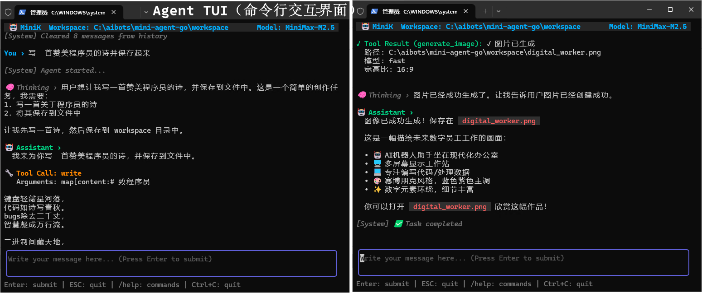
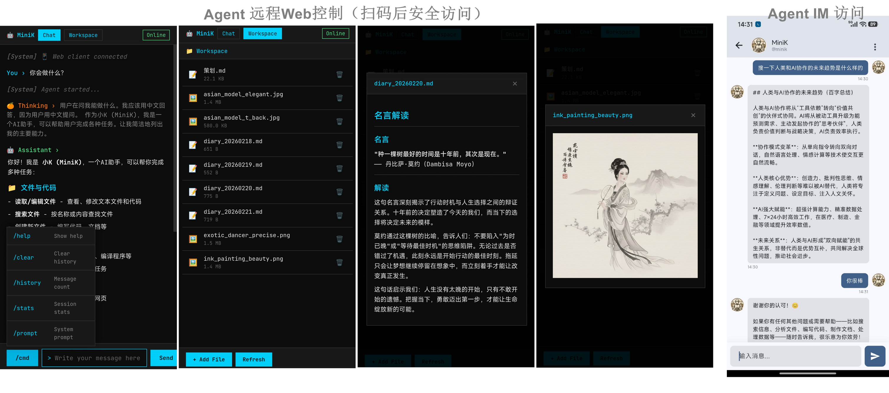
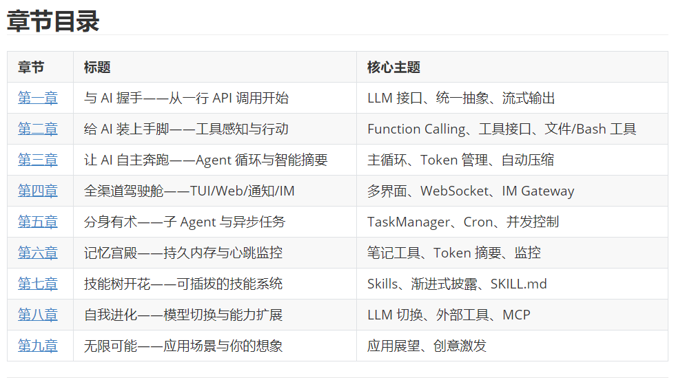

# Mini Agent Go

一个用 Go 语言实现的完整Mini AI Agent 框架，支持工具调用、自主任务执行、持久记忆、异步任务、IM 集成等能力。代码和教程全程由 Claude Code 协作实现。

## 功能特性

- **Agent 主循环** — 工具调用驱动的自主执行，内置 Token 智能摘要防止上下文溢出
- **丰富工具集** — 文件读写、Bash 执行、网页抓取、持久记忆笔记、待办管理
- **终端 TUI** — 基于 Bubbletea 的交互界面，工具调用可折叠展示，流式输出
- **远程 Web 控制** — WebSocket 实时推送，QR 码扫码连接，手机浏览器远程操作
- **IM Gateway** — 对接 Server酱 IM，通过即时通讯渠道与 Agent 对话
- **异步任务 + 定时任务** — 子 Agent 并发执行，Cron 定时触发，任务完成推送通知
- **技能系统** — 从 `.agent/skills/` 加载 SKILL.md，渐进式披露，无需重新编译
- **外部工具** — `.agent/tools/bin/` 预置任意语言实现的工具，YAML 定义接口
- **双 Provider 支持** — Anthropic Claude 和 OpenAI 兼容接口（DeepSeek、MiniMax 等）
- **全平台兼容** — 使用 `mvdan.cc/sh/v3` 纯 Go Shell，Windows/macOS/Linux 均支持

使用截图：
   
   

## 快速开始

### 1. 构建

```bash
git clone https://github.com/chuanyi/mini-agent-go.git
cd mini-agent-go
go mod tidy
go build -o mini-agent-go ./cmd
# Windows: go build -o mini-agent-go.exe ./cmd
```

### 2. 配置

```bash
cp .agent/config-example.yaml .agent/config.yaml
```

编辑 `.agent/config.yaml`：

```yaml
llm:
  api_key: "sk-ant-..."          # 你的 API Key
  model: "claude-sonnet-4-6"     # 模型名称
  provider: "anthropic"          # anthropic 或 openai

agent:
  max_steps: 200
  token_limit: 80000
  workspace_dir: "./workspace"
  system_prompt_path: "system_prompt.md"  # 可选，自定义系统提示
```

### 3. 运行

```bash
# 使用默认工作目录 (./workspace)
./mini-agent-go

# 指定工作目录
./mini-agent-go /path/to/workspace
```

启动后进入 TUI 界面，直接输入自然语言指令即可。

## 配置详解

配置文件路径（按优先级）：
1. 可执行文件同级的 `.agent/config.yaml`（推荐）
2. `~/.mini-agent/config/config.yaml`
3. `config/config.yaml`

完整配置示例：

```yaml
llm:
  api_key: "YOUR_API_KEY"
  api_base: ""                   # OpenAI 兼容接口时填写，如 https://api.deepseek.com/v1
  model: "claude-sonnet-4-6"
  provider: "anthropic"          # anthropic | openai
  max_tokens: 8192               # 最大输出 tokens（0 = 使用默认值）
  temperature: -1                # 采样温度（-1 = 使用默认值）
  retry:
    enabled: true
    max_retries: 3
    initial_delay: 1.0

agent:
  max_steps: 200                 # 最大执行步数
  token_limit: 80000             # 触发摘要压缩的 token 阈值
  workspace_dir: "./workspace"   # Agent 工作目录
  system_prompt_path: "system_prompt.md"

task:
  max_workers: 3                 # 子 Agent 最大并发数

notify:
  enabled: false
  sendkey: "SCT..."              # Server酱 SendKey，任务完成后推送通知

web_control:
  enabled: false
  host: "0.0.0.0"
  port: 18765
  show_qrcode: true              # 启动时显示二维码

# IM Gateway 渠道（可配置多个）
channels:
  - type: serverim
    account_id: "my-bot"
    send_key: "SCT..."           # Server酱 SendKey（发送消息用）
    receive_url: "https://..."   # 消息拉取 URL
```

## 工具列表

| 工具 | 说明 |
|------|------|
| `ls` | 列目录内容 |
| `read` | 读取文件（含行号） |
| `write` | 写入文件 |
| `edit` | 精确文本替换 |
| `multiedit` | 批量多处编辑 |
| `grep` | 内容搜索（ripgrep） |
| `find` | 文件名搜索（fd） |
| `bash` | 执行 Shell 命令（持久化 Session） |
| `record_note` | 写入持久记忆（`.agent/memory.json`） |
| `recall_note` | 检索持久记忆 |
| `web_fetch` | 抓取网页转 Markdown |
| `web_download` | 下载文件 |
| `todo` | 待办事项管理 |
| `task` | 创建/管理异步任务 |
| `cron` | 创建/管理定时任务 |
| `get_skill` | 按需加载技能内容 |

## TUI 快捷键

| 按键 | 功能 |
|------|------|
| `Enter` | 发送消息 |
| `Shift+Enter` | 消息内换行 |
| `Ctrl+C` / `Ctrl+Q` | 退出 |
| `/clear` | 清空对话历史 |
| `/stats` | 显示会话统计 |
| `/help` | 显示帮助 |
| `/quit` | 退出 |

## 技能系统

在 `.agent/skills/` 目录创建 SKILL.md 文件，无需重新编译即可扩展 Agent 能力：

```
.agent/skills/
└── my-skill/
    ├── SKILL.md       # 技能定义（YAML Frontmatter + Markdown 内容）
    └── scripts/       # 辅助脚本（路径自动转为绝对路径）
```

SKILL.md 格式：

```markdown
---
name: my-skill
description: 简短描述，Agent 看到这个决定是否调用
allowed-tools:
  - bash
  - read
  - write
---

# 技能内容

详细的操作流程、最佳实践、检查项……
```

启动时自动扫描加载，元数据注入 system prompt；Agent 通过 `get_skill` 工具按需加载完整内容。

## 外部工具

在 `.agent/tools/bin/` 放置可执行文件，配合 YAML 定义接口：

```
.agent/tools/bin/
├── gen_image.exe          # 任意语言实现的工具
└── gen_image.yaml         # 工具接口定义
```

YAML 定义示例（`.agent/tools/*.yaml`）：

```yaml
name: gen_image
description: 使用 AI 生成图片
binary: gen_image
parameters:
  type: object
  properties:
    prompt:
      type: string
      description: 图片描述
  required: [prompt]
```

工具二进制通过 stdin/stdout 以 JSON 格式交换数据。

## 项目结构

```
mini-agent-go/
├── cmd/
│   └── main.go                  # 程序入口
├── internal/
│   ├── agent/                   # Agent 核心（主循环、摘要、回调）
│   ├── llm/                     # LLM 客户端（Anthropic SDK、OpenAI SDK）
│   ├── tools/                   # 工具系统（接口、注册表、各工具实现）
│   ├── gateway/                 # IM Gateway（消息路由、渠道接口）
│   │   └── channels/serverim/   # Server酱 IM 渠道实现
│   ├── task/                    # 异步任务与 Cron 调度
│   ├── tui/                     # Bubbletea TUI 界面
│   ├── schema/                  # 统一数据结构定义
│   ├── config/                  # 配置加载
│   ├── storage/                 # Todo 存储
│   ├── shell/                   # 持久化 Shell 会话管理
│   ├── reflow/                  # CJK 支持的文本折行（本地 patch）
│   └── utils/                   # 日志、Token 估算等工具函数
├── docs/
│   └── tutorial/                # 教程系列（9 章）
└── .agent/                      # 运行时数据目录（放在可执行文件同级）
    ├── config.yaml              # 配置文件
    ├── config-example.yaml      # 配置示例
    ├── system_prompt.md         # 自定义系统提示（可选）
    ├── memory.json              # 持久记忆
    ├── skills/                  # 技能插件
    ├── tasks/                   # 任务持久化数据
    ├── logs/                    # 执行日志（JSONL 格式）
    └── tools/
        └── bin/                 # 外部工具二进制
```

## 架构要点

### Token 智能摘要

当对话历史接近 token 上限时，自动触发压缩：从末尾保留最近 20K tokens，将更早的历史压缩成结构化摘要（Goal / Progress / Key Decisions / Current State / Next Steps）。摘要支持增量更新，长任务也不会因上下文溢出而中断。

### 子 Agent 隔离

异步任务由独立的 Agent 实例执行，有独立的对话历史和工具集。子 Agent 不注册 `task`/`cron` 工具，防止递归创建任务。

### IM Gateway

每个 IM 渠道对应一个独立的 Agent Worker，消息路由通过 channel 类型 + 账号 ID 定位。实现 `IMChannel` 接口即可接入新的 IM 平台。

## 开发

```bash
# 编译验证
go build ./cmd

# 运行测试
go test ./...

# 运行特定包的测试
go test ./internal/tools -v
go test ./internal/agent -v
```

## 依赖

| 包 | 用途 |
|----|------|
| `anthropics/anthropic-sdk-go` | Anthropic 官方 Go SDK |
| `openai/openai-go` | OpenAI 官方 Go SDK |
| `mvdan.cc/sh/v3` | 纯 Go POSIX Shell（跨平台 bash 工具） |
| `charmbracelet/bubbletea` | TUI 框架（Elm 架构） |
| `charmbracelet/glamour` | Markdown 终端渲染 |
| `aymanbagabas/go-udiff` | Unified diff（edit 工具） |
| `easychen/serverchan-sdk-golang` | Server酱通知推送 |
| `robfig/cron/v3` | Cron 表达式解析 |
| `skip2/go-qrcode` | 终端二维码生成 |
| `nhooyr.io/websocket` | WebSocket（Web 控制） |
| `JohannesKaufmann/html-to-markdown` | 网页转 Markdown |

## 教程

详见 [`docs/`](docs/README.md)——《用 Claude Code 打造你的智能体数字员工》系列教程，从零讲解如何一步步构建Mini-Agent-Go框架的每个模块。

  

## License

MIT
